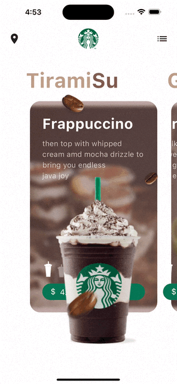

# Starbucks UI - ☕ Coffee Ordering App UI

Welcome to **Starbucks UI**, a sleek and modern Flutter UI project for a coffee ordering app inspired by Starbucks. This project features well-structured components, clear data models, and reusable widgets. It's UI-only, making it perfect for easy reskinning and future logic integration.

## 🌟 Features

- 📦 **Separated Components**: Clean and organized widget classes.
- 📊 **Data Models**: Ready-to-use data models for mock data.
- 🎨 **Customizable**: Easily reskin the app with your own theme.
- 🧩 **Reusable Widgets**: Modular and reusable UI elements.
- 🚀 **Future-Ready**: Integrate your own business logic and backend.

## 📽 Preview

## 🤝 Contributing

Contributions, issues, and feature requests are welcome! Feel free to check the [issues page](https://github.com/mo2men184/starbucks-ui/issues).

## 📝 License

This project is licensed under the MIT License.

---

💡 **Tip:** Customize this template to fit your specific use case. Happy coding! 🎉

## About the Developer 🌟

- **Mo'men M.** is passionate about creating efficient and user-friendly mobile applications. With expertise in Flutter and Firebase, Your Name focuses on delivering robust solutions that enhance user experiences and meet business objectives.
